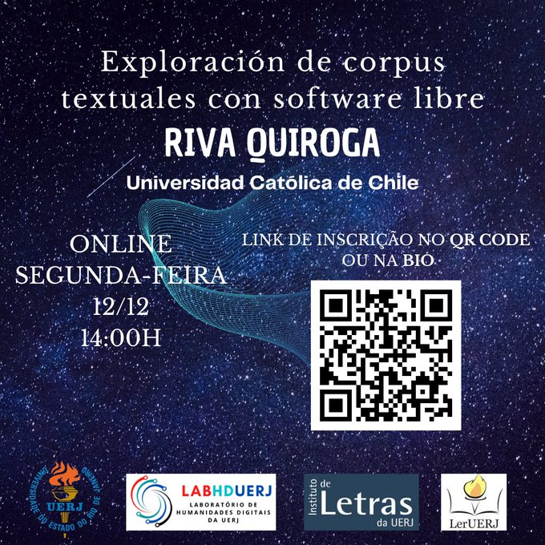

# Exploración de corpus textuales con software libre

En esta charla haremos un recorrido por distintas herramientas para la exploración de corpus textuales y discutiremos la utilidad de cada una de ellas dependiendo de nuestros objetivos de investigación. En todos los casos se trata de herramientas gratuitas y la mayoría de ellas son también de código abierto. 

## Voyant Tools

La url para utilizarlo en línea es <https://voyant-tools.org/>.

Existe [un tutorial introductorio](https://programminghistorian.org/es/lecciones/analisis-voyant-tools) publicado en Programming Historian. La traducción al portugués está en proceso de revisión, pero es posible leer [el borrador](http://programminghistorian.github.io/ph-submissions/pt/esbocos/traducoes/analise-corpus-voyant).

## AntConc

Se puede descargar desde <https://www.laurenceanthony.net/software/antconc/>. Está disponible para Windows, MacOS y Linux. En el caso de Windows, existe una versión "portable" que permite instalarlo en computadores en los que no tenemos privilegios de administración o si queremos instalaro en un _pen drive_. Existe [una lista de correos](https://groups.google.com/g/antconc) en la que es posible hacer consultas y recibir respuestas de otras personas que usan la herramienta o del mismo desarrollador. 

Existe [un tutorial introductorio](https://programminghistorian.org/es/lecciones/analisis-de-corpus-con-antconc) publicado en Programming Historian. Se trata de una traducción al español de [un tutorial publicado inicialmente en inglés](https://programminghistorian.org/en/lessons/corpus-analysis-with-antconc). 

## R: quanteda y tidytext

### quanteda: Quantitative Analysis of Textual Data

Se puede acceder a la documentación de este paquete en <https://quanteda.io/>. 

### tidytext

El libro ["Text Mining with R"](https://www.tidytextmining.com/) (disponible en línea en inglés) es una buena introducción a este paquete. Se pueden encontran tutoriales tanto en español como en portugués, principalmente de personas que ejemplifican algún tipo de aplicación es sus páginas web personales. Se puede complementar con ["Supervised Machine Learning for Text Analysis in R"](https://smltar.com/) (también disponible en línea y en inglés).

## Python: nltk, spaCy, gensim

### nltk

La documentación se encuentra disponible en <https://www.nltk.org/>. Existe un líbro que está disponible en línea (en inglés) que ilustra cómo utilizar esta librería: ["Natural Language Processing with Python"](https://www.nltk.org/book/).

El libro ["Humanities Data Analysis: Case Studies with Python"](https://www.humanitiesdataanalysis.org/) usa principalmente la librería nltk. En el caso del ejemplo sobre topic modeling, utiliza la librería [scikit-learn](https://scikit-learn.org/), enfocada en aprendizaje automático. 

### spaCy

El libro ["Introduction to Cultural Analytics & Python"](https://melaniewalsh.github.io/Intro-Cultural-Analytics/welcome.html) utiliza principalmente esta librería (aunque también recurre a nltk en el capítulo sobre análisis de sentimientos). 

El libro ["Introduction to Named Entity Recognition"](https://ner.pythonhumanities.com/intro.html) es un ejemplo de uso de spaCy para el reconocimiento de entidades nombradas. En algunos casos lo complementa con gensim. 

La documentación de esta librería se encuentra disponible en <https://spacy.io/>

### gensim

Gensim es una libreria de Python enfocada principalmente en modelación de temas. La documentación está disponible en <https://radimrehurek.com/gensim/>. 

## MALLET

Es una herramienta escrita en Java enfocada en modelación de temas. Se usa a través de la línea de comandos (Terminal). 

Existe [un tutorial introductorio]([https://programminghistorian.org/es/lecciones/analisis-de-corpus-con-antconc](https://programminghistorian.org/es/lecciones/topic-modeling-y-mallet)) publicado en Programming Historian. Se trata de una traducción al español de [un tutorial publicado inicialmente en inglés]([https://programminghistorian.org/en/lessons/corpus-analysis-with-antconc](https://programminghistorian.org/en/lessons/topic-modeling-and-mallet).

La documentación se puede consultar en <https://mimno.github.io/Mallet/topics.html>.

## UDPipe

Se puede acceder a la versión en línea en <https://lindat.mff.cuni.cz/services/udpipe/>. 

## Algunas referencias

- **Un libro que sirve como introducción sobre el uso de corpus para el análisis del discurso**: Baker, P. (2006). _Using corpora in discourse analysis_. Baker, P. (2006). Using corpora in discourse analysis. A&C Black.

- **Un libro que discute varias de las aproximaciones al uso de corpus para el análisis del discurso**: Taylor, C., & Marchi, A. (2018). _Corpus approaches to discourse. A critical review._ Routledge.

- **Un artículo que describe una metodología de análisis de textos**: Nguyen, D., Liakata, M., DeDeo, S., Eisenstein, J., Mimno, D., Tromble, R., & Winters, J. (2020). How we do things with words: Analyzing text as social and cultural data. _Frontiers in Artificial Intelligence, 3, <https://doi.org/10.3389/frai.2020.00062>.
